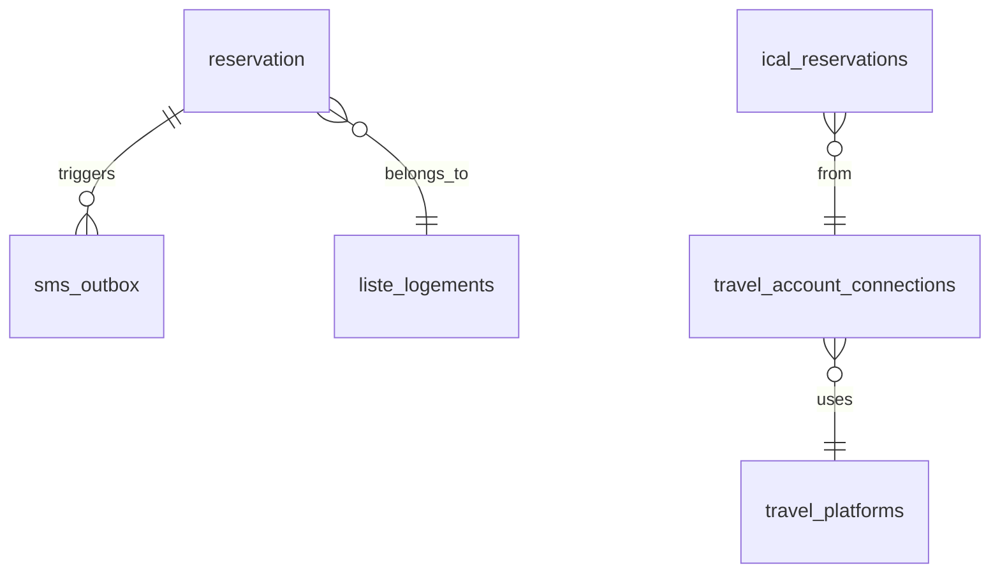

# 📋 Plan d'Amélioration du Projet SMS

> Document créé suite à l'analyse complète du projet
> Date : 17 novembre 2025

---

## 🎯 Résumé Exécutif

Le projet SMS est **fonctionnel** et gère correctement :
- ✅ Envoi/réception SMS via modems GSM
- ✅ Réservations avec SMS automatiques
- ✅ Import iCalendar multi-plateformes (Airbnb, Booking, etc.)
- ✅ Interface web moderne et intuitive

**Cependant**, il souffre de lacunes critiques en :
- ❌ **Sécurité** (pas d'authentification, injections SQL, credentials exposées)
- ❌ **Maintenabilité** (code dupliqué, pas de tests, architecture monolithique)
- ❌ **Performance** (polling intensif, pas de cache, requêtes non optimisées)

---

## 🚨 PRIORITÉ CRITIQUE - Sécurité

### 1. Authentification et Autorisation

**Problème actuel :**
- Aucun système de login sur l'interface web
- Toutes les pages accessibles sans authentification
- Données sensibles (conversations SMS, numéros de téléphone) exposées

**Solution :**
```php
// À implémenter : /web/pages/login.php
<?php
session_start();

if ($_SERVER['REQUEST_METHOD'] === 'POST') {
    $username = $_POST['username'] ?? '';
    $password = $_POST['password'] ?? '';

    // Vérifier dans la BDD avec password_hash()
    $stmt = $pdo->prepare("SELECT id, password_hash, role FROM users WHERE username = :username");
    $stmt->execute([':username' => $username]);
    $user = $stmt->fetch();

    if ($user && password_verify($password, $user['password_hash'])) {
        $_SESSION['user_id'] = $user['id'];
        $_SESSION['role'] = $user['role'];
        header('Location: dashboard.php');
        exit;
    }
}
?>
```

**Actions :**
- [ ] Créer table `users` (id, username, password_hash, role, created_at)
- [ ] Créer pages login.php et logout.php
- [ ] Ajouter vérification session dans header.php
- [ ] Implémenter système de rôles (admin, user, viewer)
- [ ] Ajouter protection CSRF avec tokens

**Effort :** 2-3 jours
**Impact :** CRITIQUE

---

### 2. Sécuriser les Credentials

**Problèmes identifiés :**

```ini
# config/config.ini - EXPOSÉ !
[DATABASE]
host = localhost
user = sms_user
password = password123  # ⚠️ MOT DE PASSE FAIBLE

[OPENAI]
api_key = sk-proj-LRiJXib...  # ⚠️ CLÉ COMPLÈTE EXPOSÉE
```

**Solutions :**

1. **Variables d'environnement**
```bash
# .env (ajouter au .gitignore)
DB_HOST=localhost
DB_USER=sms_user
DB_PASSWORD=VotreMotDePasseForT123!
OPENAI_API_KEY=sk-proj-...
ADMIN_PHONE=+33647554678
```

2. **Charger avec vlucas/phpdotenv**
```php
// web/includes/db.php
require_once __DIR__ . '/../../vendor/autoload.php';

$dotenv = Dotenv\Dotenv::createImmutable(__DIR__ . '/../..');
$dotenv->load();

$host = $_ENV['DB_HOST'];
$user = $_ENV['DB_USER'];
$password = $_ENV['DB_PASSWORD'];
```

**Actions :**
- [ ] Créer fichier .env
- [ ] Ajouter .env au .gitignore
- [ ] Installer vlucas/phpdotenv via Composer
- [ ] Migrer toutes les credentials vers .env
- [ ] Changer le mot de passe BDD
- [ ] Documenter dans README.md

**Effort :** 1 jour
**Impact :** CRITIQUE

---

### 3. Corriger les Injections SQL

**Problèmes identifiés :**

```php
// web/pages/reservation.php - LIGNE 11-32
$telephone = $conn->real_escape_string($_POST['telephone']);
$sql = "INSERT INTO reservation (...) VALUES ('$telephone', ...)";
$conn->query($sql); // ⚠️ VULNÉRABLE
```

**Solution : Tout migrer vers PDO préparé**

```php
// Correct
$stmt = $pdo->prepare("
    INSERT INTO reservation (telephone, prenom, nom, ...)
    VALUES (:telephone, :prenom, :nom, ...)
");
$stmt->execute([
    ':telephone' => $_POST['telephone'],
    ':prenom' => $_POST['prenom'],
    ':nom' => $_POST['nom'],
]);
```

**Actions :**
- [ ] Auditer TOUTES les pages PHP
- [ ] Remplacer `$conn->query()` par `$pdo->prepare()`
- [ ] Supprimer tous les `real_escape_string()`
- [ ] Tester avec sqlmap pour vérifier

**Fichiers à corriger :**
- web/pages/reservation.php
- web/pages/1.php (fichier legacy à supprimer)
- Vérifier toutes les pages avec grep

**Effort :** 2 jours
**Impact :** CRITIQUE

---

### 4. Protection XSS et Headers de Sécurité

**Actions :**
- [ ] Vérifier tous les `htmlspecialchars()` manquants
- [ ] Ajouter headers de sécurité :

```php
// web/includes/header.php (en haut)
header("X-Content-Type-Options: nosniff");
header("X-Frame-Options: DENY");
header("X-XSS-Protection: 1; mode=block");
header("Content-Security-Policy: default-src 'self'; script-src 'self' 'unsafe-inline' https://code.jquery.com https://stackpath.bootstrapcdn.com; style-src 'self' 'unsafe-inline' https://stackpath.bootstrapcdn.com https://cdnjs.cloudflare.com https://fonts.googleapis.com;");
```

**Effort :** 1 jour
**Impact :** ÉLEVÉ

---

### 5. Configurer HTTPS

**Actions :**
- [ ] Obtenir certificat SSL (Let's Encrypt)
- [ ] Configurer Apache/Nginx pour HTTPS
- [ ] Rediriger HTTP → HTTPS
- [ ] Forcer Secure cookies

```php
session_set_cookie_params([
    'lifetime' => 3600,
    'path' => '/',
    'domain' => 'votredomaine.com',
    'secure' => true,   // HTTPS uniquement
    'httponly' => true, // Pas accessible en JS
    'samesite' => 'Strict'
]);
```

**Effort :** 0.5 jour
**Impact :** CRITIQUE

---

## ⚡ PRIORITÉ ÉLEVÉE - Architecture et Code Quality

### 6. Standardiser la Connexion BDD

**Problème :**
- Mélange mysqli et PDO
- Connexion recréée dans chaque fichier
- Incohérence $conn vs $pdo

**Solution : Singleton PDO**

```php
// web/includes/Database.php
class Database {
    private static $instance = null;
    private $pdo;

    private function __construct() {
        $host = $_ENV['DB_HOST'];
        $dbname = $_ENV['DB_NAME'];
        $user = $_ENV['DB_USER'];
        $password = $_ENV['DB_PASSWORD'];

        $this->pdo = new PDO(
            "mysql:host=$host;dbname=$dbname;charset=utf8mb4",
            $user,
            $password,
            [
                PDO::ATTR_ERRMODE => PDO::ERRMODE_EXCEPTION,
                PDO::ATTR_DEFAULT_FETCH_MODE => PDO::FETCH_ASSOC,
                PDO::ATTR_EMULATE_PREPARES => false,
            ]
        );
    }

    public static function getInstance() {
        if (self::$instance === null) {
            self::$instance = new self();
        }
        return self::$instance;
    }

    public function getPdo() {
        return $this->pdo;
    }
}

// Utilisation
$pdo = Database::getInstance()->getPdo();
```

**Actions :**
- [ ] Créer classe Database
- [ ] Supprimer tous les `new mysqli()`
- [ ] Remplacer par Database::getInstance()
- [ ] Supprimer variable $conn partout

**Effort :** 1 jour
**Impact :** ÉLEVÉ

---

### 7. Nettoyer les Tables et Unifier SMS

**Tables à supprimer :**
```sql
-- Tables Gammu obsolètes (MyISAM)
DROP TABLE IF EXISTS gammu;
DROP TABLE IF EXISTS inbox;
DROP TABLE IF EXISTS outbox;
DROP TABLE IF EXISTS outbox_multipart;
DROP TABLE IF EXISTS sentitems;
DROP TABLE IF EXISTS phones;
```

**Unifier les SMS :**

Actuellement : `sms_in`, `sms_out`, `sms_outbox` (confus !)

Proposition :
```sql
-- Nouvelle table unifiée
CREATE TABLE sms (
    id INT AUTO_INCREMENT PRIMARY KEY,
    direction ENUM('in', 'out') NOT NULL,
    sender VARCHAR(20),
    receiver VARCHAR(20),
    message TEXT NOT NULL,
    status ENUM('received', 'pending', 'sent', 'failed') DEFAULT 'pending',
    modem VARCHAR(50),
    sent_at DATETIME,
    received_at DATETIME,
    created_at TIMESTAMP DEFAULT CURRENT_TIMESTAMP,
    INDEX idx_direction (direction),
    INDEX idx_status (status),
    INDEX idx_sender (sender),
    INDEX idx_receiver (receiver)
);
```

**Actions :**
- [ ] Créer script de migration
- [ ] Migrer données existantes
- [ ] Mettre à jour toutes les requêtes
- [ ] Supprimer anciennes tables

**Effort :** 2 jours
**Impact :** MOYEN

---

### 8. Ajouter Logging Proper

**Problème actuel :**
- Logs éparpillés dans les scripts Python
- Pas de rotation
- Pas de niveaux (debug, info, warning, error)

**Solution : PSR-3 Logger**

```php
// Composer
composer require monolog/monolog

// web/includes/Logger.php
use Monolog\Logger;
use Monolog\Handler\RotatingFileHandler;

class AppLogger {
    private static $logger;

    public static function getLogger() {
        if (self::$logger === null) {
            self::$logger = new Logger('sms_app');
            self::$logger->pushHandler(
                new RotatingFileHandler(__DIR__ . '/../../logs/app.log', 7, Logger::DEBUG)
            );
        }
        return self::$logger;
    }
}

// Utilisation
$logger = AppLogger::getLogger();
$logger->info('SMS envoyé', ['receiver' => $receiver]);
$logger->error('Échec envoi SMS', ['error' => $e->getMessage()]);
```

**Python :**
```python
import logging
from logging.handlers import RotatingFileHandler

logger = logging.getLogger('sms_bot')
handler = RotatingFileHandler('logs/bot.log', maxBytes=10*1024*1024, backupCount=5)
formatter = logging.Formatter('%(asctime)s - %(name)s - %(levelname)s - %(message)s')
handler.setFormatter(formatter)
logger.addHandler(handler)
logger.setLevel(logging.INFO)
```

**Actions :**
- [ ] Installer Monolog
- [ ] Créer dossier logs/ avec .gitignore
- [ ] Implémenter AppLogger
- [ ] Remplacer tous les echo/print par logger
- [ ] Configurer rotation automatique

**Effort :** 1 jour
**Impact :** MOYEN

---

### 9. Ajouter Tests

**État actuel :** 0 tests !

**Solution : PHPUnit + Pytest**

```php
// tests/Unit/SmsServiceTest.php
use PHPUnit\Framework\TestCase;

class SmsServiceTest extends TestCase {
    public function testFormatPhoneNumber() {
        $service = new SmsService();
        $this->assertEquals('+33612345678', $service->formatPhone('0612345678'));
        $this->assertEquals('+33612345678', $service->formatPhone('+33 6 12 34 56 78'));
    }

    public function testValidateSmsMessage() {
        $service = new SmsService();
        $this->assertTrue($service->validateMessage('Test'));
        $this->assertFalse($service->validateMessage(str_repeat('a', 161))); // > 160
    }
}
```

**Structure de tests :**
```
tests/
├── Unit/
│   ├── SmsServiceTest.php
│   ├── ReservationServiceTest.php
│   └── ICalParserTest.php
├── Integration/
│   ├── DatabaseTest.php
│   └── ICalSyncTest.php
└── bootstrap.php
```

**Actions :**
- [ ] Installer PHPUnit : `composer require --dev phpunit/phpunit`
- [ ] Créer structure tests/
- [ ] Écrire tests unitaires pour fonctions critiques
- [ ] Configurer CI (GitHub Actions)
- [ ] Viser coverage > 70%

**Effort :** 3-5 jours
**Impact :** ÉLEVÉ

---

## 🔧 PRIORITÉ MOYENNE - Fonctionnalités et UX

### 10. Améliorer la Gestion des Erreurs SMS

**Problème :**
- Status "failed" sans détail
- Pas de retry policy
- Pas de DLR (Delivery Reports)

**Solution :**

```sql
ALTER TABLE sms_outbox ADD COLUMN error_message TEXT;
ALTER TABLE sms_outbox ADD COLUMN retry_count INT DEFAULT 0;
ALTER TABLE sms_outbox ADD COLUMN next_retry_at DATETIME;
```

```python
# scripts/envoyer_sms.py
MAX_RETRIES = 3
RETRY_DELAYS = [60, 300, 900]  # 1min, 5min, 15min

def send_sms_with_retry(sms_id, receiver, message, modem):
    cursor.execute("SELECT retry_count FROM sms_outbox WHERE id = %s", (sms_id,))
    retry_count = cursor.fetchone()['retry_count']

    try:
        # Envoi
        send_via_modem(receiver, message, modem)
        cursor.execute("UPDATE sms_outbox SET status='sent', sent_at=NOW() WHERE id=%s", (sms_id,))
    except Exception as e:
        if retry_count < MAX_RETRIES:
            next_retry = datetime.now() + timedelta(seconds=RETRY_DELAYS[retry_count])
            cursor.execute("""
                UPDATE sms_outbox
                SET retry_count = retry_count + 1,
                    next_retry_at = %s,
                    error_message = %s
                WHERE id = %s
            """, (next_retry, str(e), sms_id))
        else:
            cursor.execute("UPDATE sms_outbox SET status='failed', error_message=%s WHERE id=%s", (str(e), sms_id))
```

**Actions :**
- [ ] Modifier schéma BDD
- [ ] Implémenter retry logic
- [ ] Ajouter page admin pour voir les échecs
- [ ] Notification email/Slack pour échecs critiques

**Effort :** 2 jours
**Impact :** MOYEN

---

### 11. Système de Backup Automatique

**Solution :**

```bash
#!/bin/bash
# scripts/backup_db.sh

DATE=$(date +%Y%m%d_%H%M%S)
BACKUP_DIR="/home/user/smsproject/backups"
DB_NAME="sms_db"

mkdir -p $BACKUP_DIR

# Dump SQL
mysqldump -u sms_user -p'password123' $DB_NAME > $BACKUP_DIR/sms_db_$DATE.sql

# Compresser
gzip $BACKUP_DIR/sms_db_$DATE.sql

# Garder seulement les 30 derniers jours
find $BACKUP_DIR -name "*.sql.gz" -mtime +30 -delete

echo "Backup créé : $BACKUP_DIR/sms_db_$DATE.sql.gz"
```

**Cron :**
```bash
# Backup quotidien à 2h du matin
0 2 * * * /home/user/smsproject/scripts/backup_db.sh >> /home/user/smsproject/logs/backup.log 2>&1
```

**Actions :**
- [ ] Créer script backup_db.sh
- [ ] Ajouter au crontab
- [ ] Tester restauration
- [ ] Configurer backup externe (S3, Dropbox, etc.)

**Effort :** 0.5 jour
**Impact :** ÉLEVÉ

---

### 12. Monitoring et Alertes

**Solution : Prometheus + Grafana (ou simple)**

**Solution simple avec healthcheck :**

```php
// web/pages/health.php
<?php
header('Content-Type: application/json');

$health = [
    'status' => 'ok',
    'timestamp' => date('c'),
    'checks' => []
];

// Check BDD
try {
    $pdo = Database::getInstance()->getPdo();
    $pdo->query('SELECT 1');
    $health['checks']['database'] = 'ok';
} catch (Exception $e) {
    $health['checks']['database'] = 'error';
    $health['status'] = 'error';
}

// Check modems
exec('ls /dev/ttyUSB* 2>&1', $output, $return);
$health['checks']['modems'] = $return === 0 ? 'ok' : 'error';

// Check queue SMS
$stmt = $pdo->query("SELECT COUNT(*) as pending FROM sms_outbox WHERE status='pending'");
$pending = $stmt->fetch()['pending'];
$health['checks']['sms_queue'] = $pending;

if ($pending > 100) {
    $health['status'] = 'warning';
}

echo json_encode($health, JSON_PRETTY_PRINT);
```

**Monitoring externe avec UptimeRobot :**
- [ ] Créer compte UptimeRobot (gratuit)
- [ ] Ajouter monitor sur /health.php
- [ ] Configurer alertes email/SMS

**Effort :** 1 jour
**Impact :** MOYEN

---

### 13. Créer une API REST

**Exemple :**

```php
// web/api/v1/sms.php
<?php
require_once '../../includes/auth_api.php'; // Vérifier token API

header('Content-Type: application/json');

$method = $_SERVER['REQUEST_METHOD'];

switch ($method) {
    case 'GET':
        // Liste des SMS
        $stmt = $pdo->query("SELECT * FROM sms_outbox ORDER BY created_at DESC LIMIT 50");
        echo json_encode($stmt->fetchAll());
        break;

    case 'POST':
        // Envoyer un SMS
        $data = json_decode(file_get_contents('php://input'), true);

        if (empty($data['receiver']) || empty($data['message'])) {
            http_response_code(400);
            echo json_encode(['error' => 'receiver et message requis']);
            exit;
        }

        $stmt = $pdo->prepare("INSERT INTO sms_outbox (receiver, message, status) VALUES (?, ?, 'pending')");
        $stmt->execute([$data['receiver'], $data['message']]);

        echo json_encode([
            'id' => $pdo->lastInsertId(),
            'status' => 'queued'
        ]);
        break;

    default:
        http_response_code(405);
        echo json_encode(['error' => 'Méthode non autorisée']);
}
```

**Documentation OpenAPI :**
```yaml
openapi: 3.0.0
info:
  title: SMS API
  version: 1.0.0
paths:
  /api/v1/sms:
    post:
      summary: Envoyer un SMS
      security:
        - ApiKeyAuth: []
      requestBody:
        content:
          application/json:
            schema:
              type: object
              properties:
                receiver:
                  type: string
                message:
                  type: string
      responses:
        '200':
          description: SMS mis en queue
```

**Actions :**
- [ ] Créer endpoints REST
- [ ] Ajouter authentification par token
- [ ] Documenter avec Swagger/OpenAPI
- [ ] Rate limiting

**Effort :** 3 jours
**Impact :** MOYEN

---

## 📦 PRIORITÉ BASSE - Déploiement et DevOps

### 14. Dockeriser le Projet

**docker-compose.yml :**

```yaml
version: '3.8'

services:
  web:
    build: .
    ports:
      - "80:80"
    volumes:
      - ./web:/var/www/html
      - ./logs:/var/www/logs
    environment:
      - DB_HOST=db
      - DB_NAME=sms_db
      - DB_USER=sms_user
      - DB_PASSWORD=${DB_PASSWORD}
    depends_on:
      - db

  db:
    image: mariadb:10.11
    environment:
      - MYSQL_ROOT_PASSWORD=${MYSQL_ROOT_PASSWORD}
      - MYSQL_DATABASE=sms_db
      - MYSQL_USER=sms_user
      - MYSQL_PASSWORD=${DB_PASSWORD}
    volumes:
      - db_data:/var/lib/mysql
      - ./sauvegarde_sms_db.sql:/docker-entrypoint-initdb.d/init.sql

  sms_bot:
    build:
      context: .
      dockerfile: Dockerfile.python
    command: python3 /app/scripts/satisfaction_bot.py
    devices:
      - /dev/ttyUSB0:/dev/ttyUSB0
    depends_on:
      - db

volumes:
  db_data:
```

**Actions :**
- [ ] Créer Dockerfile pour PHP
- [ ] Créer Dockerfile.python
- [ ] Créer docker-compose.yml
- [ ] Tester en local
- [ ] Documenter installation Docker

**Effort :** 2 jours
**Impact :** MOYEN

---

### 15. Documentation Complète

**À créer :**

```markdown
# README.md

## 🚀 Installation

### Prérequis
- PHP 8.0+
- MariaDB 10.5+
- Python 3.8+
- Modem GSM/3G

### Étapes
1. Cloner le repo
2. Copier .env.example vers .env
3. Modifier les credentials
4. Installer dépendances :
   ```bash
   composer install
   pip install -r requirements.txt
   ```
5. Importer la BDD :
   ```bash
   mysql -u root -p sms_db < sauvegarde_sms_db.sql
   ```
6. Configurer le modem :
   ```bash
   python3 scripts/config_modem.py
   ```
7. Lancer les services :
   ```bash
   python3 scripts/satisfaction_bot.py &
   python3 scripts/envoyer_sms.py &
   ```

## 📖 Documentation

- [Architecture](docs/architecture.md)
- [API Reference](docs/api.md)
- [Configuration](docs/configuration.md)
- [Troubleshooting](docs/troubleshooting.md)
```

**Schéma BDD (Mermaid) :**


**Actions :**
- [ ] Créer README.md complet
- [ ] Documenter architecture
- [ ] Créer schémas BDD
- [ ] Documenter API
- [ ] Guide troubleshooting

**Effort :** 2 jours
**Impact :** ÉLEVÉ (pour maintenabilité)

---

## 📊 Récapitulatif des Priorités

| Priorité | Amélioration | Effort | Impact | Status |
|----------|-------------|--------|--------|--------|
| 🔴 CRITIQUE | 1. Authentification | 2-3j | CRITIQUE | ❌ À faire |
| 🔴 CRITIQUE | 2. Sécuriser credentials | 1j | CRITIQUE | ❌ À faire |
| 🔴 CRITIQUE | 3. Corriger injections SQL | 2j | CRITIQUE | ❌ À faire |
| 🔴 CRITIQUE | 4. Headers sécurité + XSS | 1j | ÉLEVÉ | ❌ À faire |
| 🔴 CRITIQUE | 5. Configurer HTTPS | 0.5j | CRITIQUE | ❌ À faire |
| 🟠 ÉLEVÉ | 6. Standardiser BDD | 1j | ÉLEVÉ | ❌ À faire |
| 🟠 ÉLEVÉ | 7. Nettoyer tables | 2j | MOYEN | ❌ À faire |
| 🟠 ÉLEVÉ | 8. Logging proper | 1j | MOYEN | ❌ À faire |
| 🟠 ÉLEVÉ | 9. Ajouter tests | 3-5j | ÉLEVÉ | ❌ À faire |
| 🟡 MOYEN | 10. Gestion erreurs SMS | 2j | MOYEN | ❌ À faire |
| 🟡 MOYEN | 11. Backup automatique | 0.5j | ÉLEVÉ | ❌ À faire |
| 🟡 MOYEN | 12. Monitoring | 1j | MOYEN | ❌ À faire |
| 🟡 MOYEN | 13. API REST | 3j | MOYEN | ❌ À faire |
| 🟢 BASSE | 14. Docker | 2j | MOYEN | ❌ À faire |
| 🟢 BASSE | 15. Documentation | 2j | ÉLEVÉ | ❌ À faire |

**Total effort estimé :** 25-29 jours

---

## 🎯 Roadmap Suggérée

### Phase 1 : Sécurité (1-2 semaines)
- Authentification
- Variables d'environnement
- Corriger injections SQL
- HTTPS

### Phase 2 : Code Quality (1-2 semaines)
- Standardiser BDD
- Logging
- Tests unitaires
- Nettoyer code legacy

### Phase 3 : Fonctionnalités (1-2 semaines)
- Gestion erreurs SMS
- Backup automatique
- Monitoring
- API REST

### Phase 4 : DevOps (1 semaine)
- Docker
- CI/CD
- Documentation complète

---

## 📞 Support

Pour toute question sur ce plan d'amélioration, consultez :
- Documentation technique : `/docs`
- Issues GitHub : créer une nouvelle issue
- Email : votre.email@example.com

---

*Document généré automatiquement lors de l'audit du projet - Novembre 2025*
